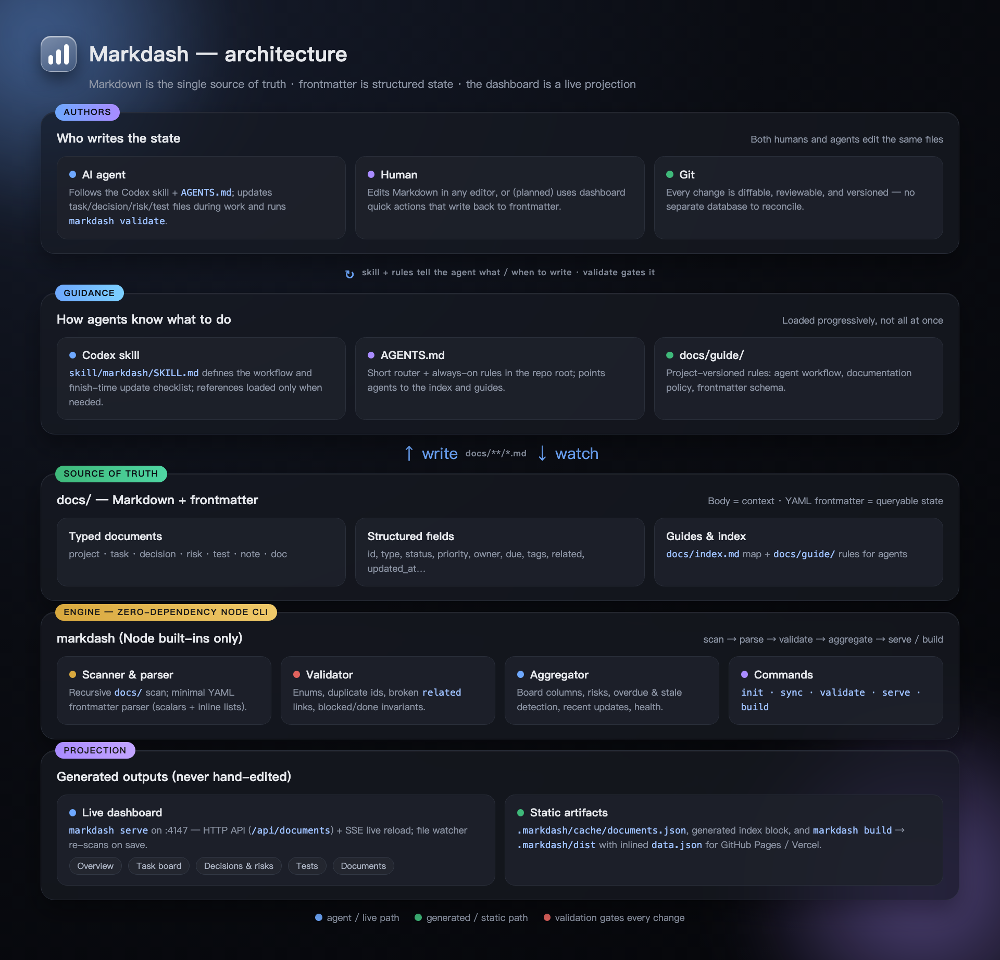

<p align="center">
  
</p>

# Markdash

> A Markdown-driven, AI-agent-friendly project dashboard.

Markdash keeps your project state in plain Markdown that lives in your repo.
Frontmatter is the structured state, the document body holds the context, and
the dashboard is a read-only projection rendered on top. No database, no
vendor lock-in — everything is diffable and reviewable with Git.

It is designed around two readers at once:

- **Humans** get a dashboard showing health, a suggested next step, the task
  board, decisions, risks, tests, and recently updated documents.
- **AI agents** get a stable document map and an explicit update policy, so a
  new agent can take over after reading `docs/index.md` and only the files it
  links to — without scanning the whole repository.

## Why Markdash

- **Single source of truth.** Tasks, decisions, risks, and tests are Markdown
  files; the dashboard never owns business data.
- **Live updates.** `markdash serve` watches `docs/` and hot-reloads the browser
  as agents or humans save files.
- **AI-native by default.** A Codex skill and short `AGENTS.md` rules tell agents
  when and how to update documentation, backed by a `validate` command.
- **Zero runtime dependencies.** The CLI uses only Node.js built-in modules; the
  dashboard is plain HTML/CSS/JavaScript with no build step.
- **Static-friendly.** Export a fully static dashboard to publish on GitHub Pages,
  Vercel, or Netlify.

## Quick start

Requirements: Node.js 18 or newer.

The package is not published to npm yet, so use one of the following instead of
`npm install -g markdash`.

**Option 1 - clone and link (recommended for local development)**

```bash
git clone https://github.com/zhuyifan2013/markdash.git
cd markdash
npm link        # makes the global `markdash` command point at this checkout

cd ../your-project
markdash init
markdash serve  # http://localhost:4147
```

**Option 2 - run directly from a clone (no global command)**

```bash
git clone https://github.com/zhuyifan2013/markdash.git
node /path/to/markdash/bin/markdash.js init
node /path/to/markdash/bin/markdash.js serve
```

You can add an alias or a `package.json` script, e.g.
`"dashboard": "node /path/to/markdash/bin/markdash.js serve"`.

**Option 3 - vendor the CLI into your own repository**

Copy `bin/`, `src/`, `web/`, and `assets/` into your project (for example
under `tools/markdash/`) and run `node tools/markdash/bin/markdash.js serve`.
This keeps the dashboard reproducible without depending on a published package.

> Publishing to npm (so `npm install -g markdash` / `npx markdash` works) is
> tracked as a future task; see `docs/tasks/npm-publish.md`.

During development, run validation after editing documents:

```bash
markdash validate
```

## Commands

| Command | Description |
|---|---|
| `markdash init` | Create `docs/`, guides, templates, and append a Markdash section to `AGENTS.md` |
| `markdash sync` | Scan Markdown, refresh `.markdash/cache/documents.json` and the generated block in `docs/index.md` |
| `markdash validate` | Validate frontmatter, enums, duplicate ids, and broken links; refreshes the cache |
| `markdash serve` | Start the dashboard with file watching and live reload (default port 4147, override with `--port=4200`) |
| `markdash build` | Emit a static dashboard (with inlined data) to `.markdash/dist` |

Commands exit with code `2` and print guidance when run outside a Markdash
project; `validate` exits with code `1` on validation errors.

## Document model

Every tracked file starts with YAML frontmatter using scalars and inline lists:

```yaml
---
id: login-flow
title: Login flow
type: task            # project | task | decision | risk | test | note | doc
status: in_progress
priority: high        # task/risk only: urgent | high | medium | low
owner: ai
tags: [auth, web]
related: [decision-session-strategy]
created_at: 2026-09-16
updated_at: 2026-09-16
---
```

Four distinct dimensions, never conflated:

- **type** — what the document is (decides which view shows it)
- **status** — its stage, with a per-type enum
- **priority** — importance (`P0–P3`), for tasks and risks only
- **tags** — free-form topics used only for filtering (never encode status here)

See [docs/guide/metadata-schema.md](docs/guide/metadata-schema.md) for the full
schema and [docs/guide/documentation-policy.md](docs/guide/documentation-policy.md)
for the update policy.

## Architecture

Markdown is the single source of truth, frontmatter is structured state, and
the dashboard is a read-only projection. Humans and AI agents edit the same
`docs/` files; the zero-dependency Node CLI scans, validates, aggregates, and
either serves a live dashboard or builds a static one.

<p align="center">
  
</p>

The pipeline is `scan -> parse -> validate -> aggregate -> serve / build`:

- **Authors** — AI agents, humans, and Git all work on the same Markdown.
- **Guidance** — the Codex skill, a root `AGENTS.md` router, and `docs/guide/` tell agents what to read and when to update; `validate` gates every change.
- **Source of truth** — `docs/**/*.md`: typed documents with queryable frontmatter plus a document index and agent guides.
- **Engine** — the dependency-free `markdash` CLI handles scanning, frontmatter parsing, validation, and aggregation.
- **Projection** — generated-only outputs: the live dashboard (`:4147`, SSE hot reload) or a static build for GitHub Pages / Vercel.

## Repository layout

```text
AGENTS.md                 Short router + always-on rules for agents
bin/markdash.js           CLI entry point
src/                      CLI implementation (Node built-ins only)
web/                      Static dashboard (HTML/CSS/vanilla JS)
assets/                   Guides and templates copied by `markdash init`
skill/markdash/           Distributable Codex skill
docs/                     Markdash's own project data (self-bootstrapped example)
templates/                Document templates
.markdash/cache/          Generated scan cache (gitignored)
.markdash/dist/           Generated static dashboard (gitignored)
```

This repository uses Markdash to manage itself, so `docs/` is also a working
end-to-end example.

## AI agent skill

Markdash ships with an installable [Codex](https://developers.openai.com/codex/)
skill that teaches agents how to keep project documents current as they work, so
documentation updates become part of the task rather than an afterthought. It is
a key part of the architecture — the *Guidance* layer that tells agents what and
when to write.

### Install

Copy the skill into your Codex skills directory (or clone and symlink it):

```bash
cp -R skill/markdash ~/.codex/skills/markdash
```

A new session then makes the skill available automatically. The CLI itself has no
dependency on the skill; the skill only governs agent behavior.

### Layout and progressive disclosure

```text
skill/markdash/
├── SKILL.md                    # Entry point: shared workflow, always relevant
└── references/
    ├── metadata.md             # Frontmatter fields, enums, examples
    └── workflow.md             # Event -> document map, what not to document
```

Agents load the short `SKILL.md` when the skill applies, and read a reference
only when the current task needs it (writing frontmatter, or deciding what to
record). Project rules under `docs/guide/` take precedence over skill defaults.

### What the skill enforces

1. Read `docs/index.md` first, then only the linked documents relevant to the
   task — never scan the whole repository.
2. Before finishing, classify the work: progress / decision / risk / test /
   operations change, stale document found, or **no-knowledge-change**.
3. For every class except `no-knowledge-change`, update the matching Markdown
   file and its `updated_at`, then run `markdash validate`.

Decision rule for agents:

> If the next agent could not continue, verify results, or troubleshoot using
> only code and docs — without reading this chat — update the document.
> Otherwise, stay silent and do not create documentation noise.

The same behavior works for other AI tools via `AGENTS.md` (a short router in
the repo root) and the versioned rules in `docs/guide/`; auto-loading rule
generation for Cursor, Claude Code, and GitHub Copilot is on the roadmap.

## Local development

```bash
git clone https://github.com/zhuyifan2013/markdash.git
cd markdash
npm link            # makes the `markdash` command point at this checkout
markdash validate
markdash serve
```

Run the test suite (planned; see `docs/tasks/cli-tests.md`):

```bash
node --test
```

## Roadmap

- Dashboard quick actions that write back to frontmatter
- Git hooks and CI integration for `validate` (`--format json`)
- Auto-loading rule generation for Cursor, Claude Code, and GitHub Copilot
- A published npm package and an installable Codex skill release

See `docs/tasks/` for the live backlog.

## Contributing

Contributions are welcome. Please open an issue first for substantial changes,
keep the CLI dependency-free unless there is a strong reason, and run
`markdash validate` before submitting a pull request.

## License

[MIT](LICENSE)
